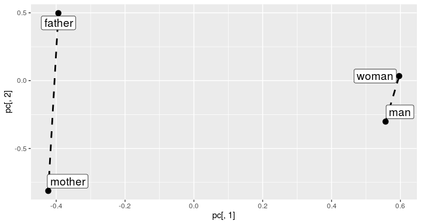
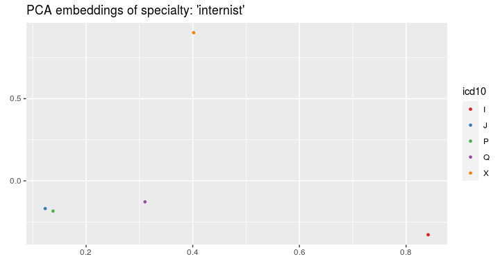
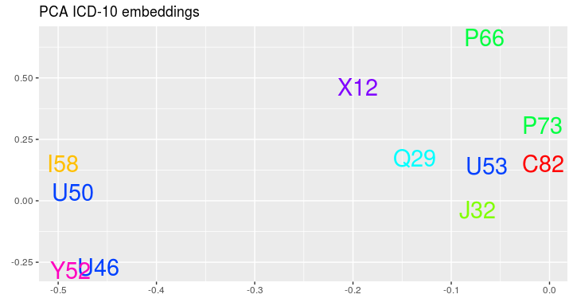

<!-- README.md is generated from README.Rmd. Please edit that file -->
memr
====

Medical records embeddings
--------------------------

The `memr`(Multisource Embeddings for Medical Records) package in R allows for creating embeddings, i.e. vector representations, of medical free-text records written by doctors. It also provides a wide spectrum of tools to data visualization and medical visits' segmentation. These tools aim to develop computer-supported medicine by facilitating medical data analysis and iterpretation. The package can be exploited for many applications like the recommendation prediction, patients' clustering etc. that can aid doctors in their practice.

Installation & Dependences
--------------------------

`memr` is written in R and is based on the following packages:

-   dplyr
-   ggplot2
-   ggrepel
-   Rtsne
-   text2vec

To install `memr`, simply type in an R console (after having installed the `devtools` package, e.g. `install.package('devtools')`):

``` r
devtools::install_git("https://github.com/MI2DataLab/memr")
```

Usage
-----

### Example datasets

We show the usage of the package on the example datasets. They are completely artificial, but their structure reflects a structure of the real data collected from Polish health centers. The results of the research on the real data are described in the paper Dobrakowski et al. (2019).

For every visit we can have some information about ICD-10 code of diagnosed disease, ID and specialty of the doctor:

``` r
knitr::kable(visits)
```

| visit\_id | icd10 | doctor\_id | specialties                      |
|:----------|:------|:-----------|:---------------------------------|
| 101       | J32   | 24         | endocrinologist, internist       |
| 102       | Y52   | 26         | endocrinologist                  |
| 103       | X12   | 24         | endocrinologist, internist       |
| 104       | Q29   | 24         | endocrinologist, internist       |
| 105       | U46   | 26         | endocrinologist                  |
| 106       | U50   | 26         | endocrinologist                  |
| 107       | I58   | 25         | cardiologist, internist          |
| 108       | C82   | 26         | endocrinologist                  |
| 109       | P73   | 24         | endocrinologist, internist       |
| 110       | P66   | 26         | endocrinologist                  |
| 111       | U53   | 23         | ophthalmologist, endocrinologist |

For the visits we have also the descriptions of interview with the extracted medical terms:

``` r
knitr::kable(interviews)
```

|     | x                 |
|-----|:------------------|
| 101 | fever, eye        |
| 102 | cough, thyroid    |
| 103 | fever, thyroid    |
| 104 | fever, eye        |
| 105 | cough, thyroid    |
| 106 | cough, thyroid    |
| 107 | cough, thyroid    |
| 108 | rhinitis, eye     |
| 109 | rhinitis, eye     |
| 110 | rhinitis, thyroid |

Descriptions of examinations of patients:

``` r
knitr::kable(examinations)
```

|     | x                                 |
|-----|:----------------------------------|
| 102 | mother, father, cough, eye        |
| 103 | woman, father, rhinitis, thyroid  |
| 104 | woman, father, fever, thyroid     |
| 105 | mother, patient, rhinitis, eye    |
| 106 | man, father, cough, heart         |
| 107 | woman, father, fever, eye         |
| 108 | woman, patient, rhinitis, thyroid |
| 109 | woman, patient, rhinitis, heart   |
| 110 | woman, father, cough, heart       |
| 111 | man, father, rhinitis, eye        |

And descriptions of recommendations prescribed by doctors to the patients:

``` r
knitr::kable(recommendations)
```

|     | x                                    |
|-----|:-------------------------------------|
| 103 | hospital, endocrinologist            |
| 104 | hospital, sleep, internist           |
| 105 | hospital, internist                  |
| 106 | sleep, ophthalmologist               |
| 107 | hospital, treatment, ophthalmologist |
| 108 | treatment, ophthalmologist           |
| 109 | treatment, hospital, endocrinologist |
| 110 | hospital, sleep, cardiologist        |

Each medical term has one or more categories:

``` r
knitr::kable(terms_categories)
```

| term            | category       |
|:----------------|:---------------|
| man             | person         |
| woman           | person         |
| mother          | person         |
| father          | person         |
| patient         | person         |
| cough           | disease        |
| rhinitis        | disease        |
| fever           | disease        |
| sleep           | recommendation |
| healthy eating  | recommendation |
| hospital        | recommendation |
| treatment       | recommendation |
| internist       | specialty      |
| cardiologist    | specialty      |
| ophthalmologist | specialty      |
| endocrinologist | specialty      |
| heart           | anatomic       |
| eye             | anatomic       |
| thyroid         | anatomic       |

### Medical terms embeddings

Firstly we can compute embeddings:

``` r
embedding_size <- 5

interview_term_vectors <- embed_terms(merged_terms = interviews, embedding_size = embedding_size,
                                       term_count_min = 1L)
#> INFO [2020-03-18 11:43:54] 2020-03-18 11:43:54 - epoch 1, expected cost 0.1305
#> INFO [2020-03-18 11:43:54] 2020-03-18 11:43:54 - epoch 2, expected cost 0.0852
#> INFO [2020-03-18 11:43:54] 2020-03-18 11:43:54 - epoch 3, expected cost 0.0592
#> INFO [2020-03-18 11:43:54] 2020-03-18 11:43:54 - epoch 4, expected cost 0.0426
#> INFO [2020-03-18 11:43:54] 2020-03-18 11:43:54 - epoch 5, expected cost 0.0314
#> INFO [2020-03-18 11:43:54] 2020-03-18 11:43:54 - epoch 6, expected cost 0.0235
#> INFO [2020-03-18 11:43:54] 2020-03-18 11:43:54 - epoch 7, expected cost 0.0180
#> INFO [2020-03-18 11:43:54] 2020-03-18 11:43:54 - epoch 8, expected cost 0.0139
#> INFO [2020-03-18 11:43:54] 2020-03-18 11:43:54 - epoch 9, expected cost 0.0109
#> INFO [2020-03-18 11:43:54] 2020-03-18 11:43:54 - epoch 10, expected cost 0.0087
#> INFO [2020-03-18 11:43:54] 2020-03-18 11:43:54 - epoch 11, expected cost 0.0070
#> INFO [2020-03-18 11:43:54] 2020-03-18 11:43:54 - epoch 12, expected cost 0.0057
#> INFO [2020-03-18 11:43:54] 2020-03-18 11:43:54 - epoch 13, expected cost 0.0047
#> INFO [2020-03-18 11:43:54] 2020-03-18 11:43:54 - epoch 14, expected cost 0.0039
#> INFO [2020-03-18 11:43:54] 2020-03-18 11:43:54 - epoch 15, expected cost 0.0033
examination_term_vectors <- embed_terms(merged_terms = examinations, embedding_size = embedding_size,
                                         term_count_min = 1L)
#> INFO [2020-03-18 11:43:54] 2020-03-18 11:43:54 - epoch 1, expected cost 0.1059
#> INFO [2020-03-18 11:43:54] 2020-03-18 11:43:54 - epoch 2, expected cost 0.0510
#> INFO [2020-03-18 11:43:54] 2020-03-18 11:43:54 - epoch 3, expected cost 0.0315
#> INFO [2020-03-18 11:43:54] 2020-03-18 11:43:54 - epoch 4, expected cost 0.0225
#> INFO [2020-03-18 11:43:54] 2020-03-18 11:43:54 - epoch 5, expected cost 0.0178
#> INFO [2020-03-18 11:43:54] 2020-03-18 11:43:54 - epoch 6, expected cost 0.0149
#> INFO [2020-03-18 11:43:54] 2020-03-18 11:43:54 - epoch 7, expected cost 0.0131
#> INFO [2020-03-18 11:43:54] 2020-03-18 11:43:54 - epoch 8, expected cost 0.0117
#> INFO [2020-03-18 11:43:54] 2020-03-18 11:43:54 - epoch 9, expected cost 0.0107
#> INFO [2020-03-18 11:43:54] 2020-03-18 11:43:54 - epoch 10, expected cost 0.0099
#> INFO [2020-03-18 11:43:54] 2020-03-18 11:43:54 - epoch 11, expected cost 0.0093
#> INFO [2020-03-18 11:43:54] 2020-03-18 11:43:54 - epoch 12, expected cost 0.0087
#> INFO [2020-03-18 11:43:54] 2020-03-18 11:43:54 - epoch 13, expected cost 0.0082
#> INFO [2020-03-18 11:43:54] 2020-03-18 11:43:54 - epoch 14, expected cost 0.0078
#> INFO [2020-03-18 11:43:54] 2020-03-18 11:43:54 - epoch 15, expected cost 0.0074

knitr::kable(interview_term_vectors[1:5, ])
```

|          |            |            |            |            |            |
|:---------|-----------:|-----------:|-----------:|-----------:|-----------:|
| rhinitis |  -0.4704351|   0.0315635|   0.5707754|   0.2680295|   0.2400996|
| fever    |  -0.3948241|   0.3853350|   0.5458298|   0.2350670|   0.4494087|
| eye      |   0.4959916|   0.0223423|  -0.3431036|  -0.2673065|  -0.2371423|
| cough    |  -0.0089209|   0.3737412|   0.0054367|  -0.6043935|   0.4064513|
| thyroid  |  -0.1455389|  -0.2107478|  -0.2871478|  -0.3121039|  -0.2287994|

Terms from the chosen category can be visualized:

``` r
visualize_term_embeddings(terms_categories, interview_term_vectors, c("anatomic"), method = "PCA")
```


To validate the quality of embeddings we can perform the term analogy task (see more by ?analogy\_task). The package delivers the analogy test set.

``` r
knitr::kable(evaluate_term_embeddings(examination_term_vectors, n = 5, terms_pairs_test))
```

|         |    1|    2|    3|    4|          5|       MEAN|
|---------|----:|----:|----:|----:|----------:|----------:|
| person  |    0|    0|    0|    0|  0.5000000|  0.1000000|
| spec    |    0|    0|    0|    0|  0.0000000|  0.0000000|
| synonym |    0|    0|    0|    0|  0.5000000|  0.1000000|
| MEAN    |    0|    0|    0|    0|  0.3333333|  0.0666667|

For each type of analogy we compute the mean accuracy.

Analogies can be plotted to see if the connection lines are parallel:

``` r
visualize_analogies(examination_term_vectors, terms_pairs_test$person, find_analogies = TRUE, n = 10)
```



### Visits embeddings

Having the embeddings of terms, we can compute embeddings of visits:

``` r
visits_vectors <- embed_list_visits(interviews, examinations, interview_term_vectors, examination_term_vectors)
knitr::kable(visits_vectors[1:5, ])
```

|     |            |           |            |            |           |           |            |            |            |            |
|:----|-----------:|----------:|-----------:|-----------:|----------:|----------:|-----------:|-----------:|-----------:|-----------:|
| 101 |   0.0505837|  0.2038387|   0.1013631|  -0.0161198|  0.1061332|         NA|          NA|          NA|          NA|          NA|
| 102 |  -0.0772299|  0.0814967|  -0.1408555|  -0.4582487|  0.0888259|  0.1106313|  -0.1679365|  -0.0600053|   0.1011591|   0.0932502|
| 103 |  -0.2701815|  0.0872936|   0.1293410|  -0.0385184|  0.1103047|  0.1915759|   0.1393210|  -0.0021371|   0.0500974|   0.1605039|
| 104 |   0.0505837|  0.2038387|   0.1013631|  -0.0161198|  0.1061332|  0.1695910|   0.1284853|   0.0011363|  -0.0126280|  -0.0033302|
| 105 |  -0.0772299|  0.0814967|  -0.1408555|  -0.4582487|  0.0888259|  0.0037491|  -0.0883031|  -0.0408950|   0.1075936|   0.0625818|

And now we can visualize the visits on the plot and color by the doctors' IDs:

``` r
visualize_visit_embeddings(visits_vectors, visits, color_by = "doctor",
                                spec = "internist")
```


or by ICD-10 code:

``` r
visualize_visit_embeddings(visits_vectors, visits, color_by = "icd10",
                                spec = "internist")
```



### Clustering

On the visits' embeddings we can run the k-means algorithm:

``` r
clusters <- cluster_visits(visits_vectors, visits, spec = "internist", cluster_number = 2)
```

and plot the clusters:

``` r
visualize_visit_embeddings(visits_vectors, visits, color_by = "cluster",
                                spec = "internist", clusters = clusters)
```


For every cluster we can see the most frequent recommendations from chosen categories:

``` r
rec_tables <- get_cluster_recommendations(recommendations, clusters,
                                          category = "recommendation",
                                          recom_table = terms_categories)
rec_tables
#> [[1]]
#> # A tibble: 3 x 3
#>   recommendation count frequency
#>   <fct>          <int>     <dbl>
#> 1 hospital           3      0.75
#> 2 sleep              1      0.25
#> 3 treatment          1      0.25
#> 
#> [[2]]
#> # A tibble: 2 x 3
#>   recommendation count frequency
#>   <fct>          <int>     <dbl>
#> 1 hospital           1         1
#> 2 treatment          1         1
```

or from all categories:

``` r
rec_tables <- get_cluster_recommendations(recommendations, clusters, category = "all")
rec_tables
#> [[1]]
#> # A tibble: 5 x 3
#>   recommendation  count frequency
#>   <fct>           <int>     <dbl>
#> 1 hospital            3      0.75
#> 2 endocrinologist     2      0.5 
#> 3 internist           1      0.25
#> 4 sleep               1      0.25
#> 5 treatment           1      0.25
#> 
#> [[2]]
#> # A tibble: 3 x 3
#>   recommendation  count frequency
#>   <fct>           <int>     <dbl>
#> 1 hospital            1         1
#> 2 ophthalmologist     1         1
#> 3 treatment           1         1
```

If we have a new visit, we can assign it to the most appropriate cluster:

``` r
inter_descr <- paste("cough", sep = ", ")
exam_descr <- paste("fever", sep = ", ")
visit_description <- c(inter_descr, exam_descr)
names(visit_description) <- c("inter", "exam")
cl <- assign_visit_to_cluster(visit_description, clusters, interview_term_vectors, examination_term_vectors)
cl
#> $cl
#> 1 
#> 1 
#> 
#> $distances
#>          1          2 
#> 0.07533538 0.24136356
```

As the last nice thing we can see the embeddings of ICD-10 codes:

``` r
visualize_icd10(visits_vectors, visits)
```



Acknowledgements
================

The package was created during the research financially supported by the Polish Centre for Research and Development (Grant POIR.01.01.01-00-0328/17).

References
==========

Dobrakowski, Adam, Agnieszka Mykowiecka, Małgorzata Marciniak, Wojciech Jaworski, and Przemysław Biecek. 2019. “Interpretable Segmentation of Medical Free-Text Records Based on Word Embeddings.” *arXiv Preprint arXiv:1907.04152*. <https://arxiv.org/abs/1907.04152>.
