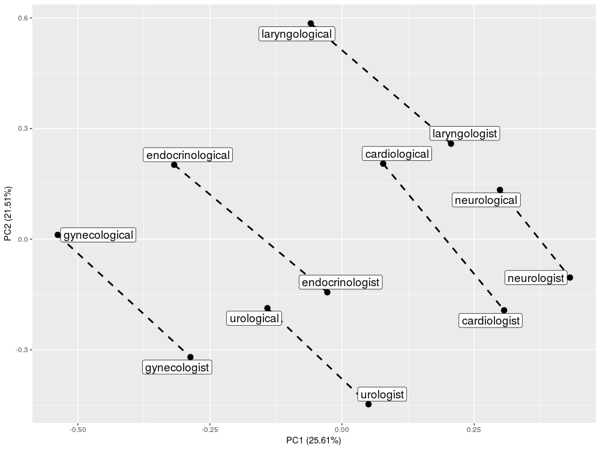
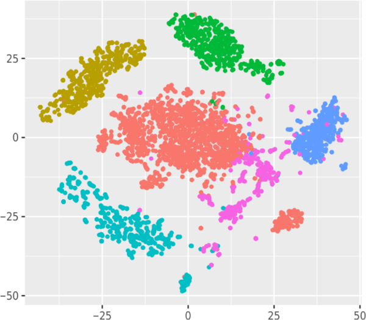
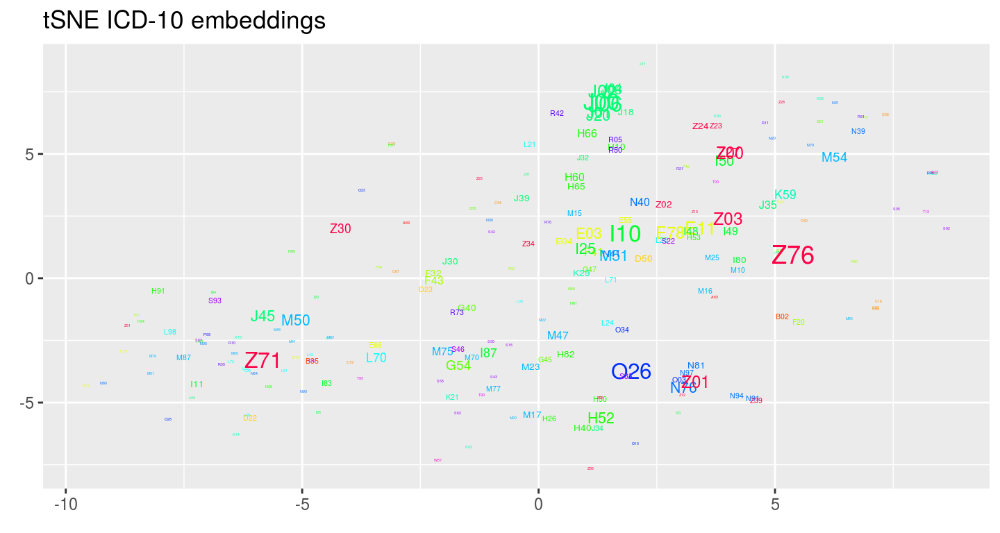

<!-- JOSS welcomes submissions from broadly diverse research areas. For this reason, we require that authors include in the paper some sentences that explain the software functionality and domain of use to a non-specialist reader. We also require that authors explain the research applications of the software. The paper should be between 250-1000 words.

Your paper should include:

A summary describing the high-level functionality and purpose of the software for a diverse, non-specialist audience.
A clear Statement of Need that illustrates the research purpose of the software.
A list of key references, including to other software addressing related needs.

Mention (if applicable) of any past or ongoing research projects using the software and recent scholarly publications enabled by it.
-->

# Summary

The ``memr`` package in R allows for creating embeddings, i.e. vector
representations, of medical free-text records written by doctors. It also
provides a wide spectrum of tools to data visualization and medical
visits' segmentation. These tools aim to develop computer-supported medicine by
facilitating medical data analysis and iterpretation. The package can be exploited for
many applications like the recommendation prediction, patients' clustering etc. that
can aid doctors in their practice.

# Processing of medical records

Processing of free-text clinical records plays an important role in computer-supported
medicine. A detailed description of symptoms, examination and an interview
is often stored in an unstructured way as
free-text, hard to process but rich in important information.

The most straightforward approach to the processing of clinical notes could be their
clustering with respect to different features like diagnosis or type of treatment.
Grouping of visits can fulfil many potential goals. If we are able to group visits into
clusters based on interview with a patient and medical examination then (1) we can
follow recommendations that were suggested to patients with similar history to create
a list of possible diagnoses, (2) reveal that the current diagnosis is unusual, (3) identify
subsets of visits with the same diagnosis but different symptoms.

# memr package

The basis of ``memr`` is creating of medical terms embeddings based on GloVe algorithm [@pennington2014glove] implemented in R package ``text2vec`` by @text2vec. `memr` allows for validation the quality of computed embeddings by performing and visualizing 'word analogy task' introduced by @mikolov2013efficient. The function `visualize_analogies` produces PCA plots (with ``ggplot2`` package) of given pairs of terms:

The embeddings of medical terms are averaged and concatenated to obtain the representation of visit.

By ``memr`` we can perform visits clustering by the k-means algorithm and visualize the visits by the t-SNE algorithm [@maaten2008visualizing] with the use of ``Rtsne`` [@krijthe2015rtsne] package (on the plot each dot corresponds to one visit):

``memr`` allows also for visualization of ICD-10 codes by averaging visits' embeddings:

# Acknowledgements

The package was created during the research financially supported by the Polish Centre for Research and Development
(Grant POIR.01.01.01-00-0328/17). The results of the research are described in the paper @dobrakowski2019patients.

# References
